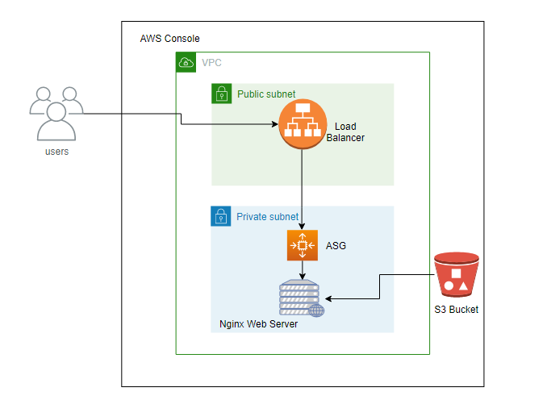

# Installing Nginx Web Server using User Data and building it through Auto Scaling Group 

## Problem Statement: 

- Run Nginx behind ASG using userdata
- Nginx config file change , pick contents from s3 and host a static website on nginx
- Push custom memory metrics and nginx logs in CloudWatch.

## Services Used

- Load Balancer 
- Auto Scaling Group 
- Launch Template 
- EC2  
- CloudWatch

## Things covered

- S3 bucket to store the contents.
- Bucket Policy for giving access to objects.
- User data for installing Nginx Web Server through Launch Template.
- Installation of Cloudwatch.

## Bucket policy template to get S3 objects.
Bucket Policy template : [Template](https://gitlab.com/gokloud-devs/cloudengineering-training/-/blob/shantul/AWS/Static-Website-Hosting/shantul/Bucket_Policy.txt)

## User Data template for installtion of Nginx
User Data template : [Template](https://gitlab.com/gokloud-devs/cloudengineering-training/-/blob/shantul/AWS/Static-Website-Hosting/shantul/User_Data.txt)

## Configuration file for Nginx
Nginx Config File : [Template](https://gitlab.com/gokloud-devs/cloudengineering-training/-/blob/shantul/AWS/Static-Website-Hosting/shantul/nginx.conf)

## Installation of CloudWatch
For installing cloud watch either you can provide it in User Data or you can login to server and install it.

### Installing Nginx and Cloudwatch from User Data 
User Data Nginx-Cloudwatch template : [Template](https://gitlab.com/gokloud-devs/cloudengineering-training/-/blob/shantul/AWS/Static-Website-Hosting/shantul/User-Data-CloudWatch-Nginx.txt)
JSON template for Cloudwatch metrics : [Template](https://gitlab.com/gokloud-devs/cloudengineering-training/-/blob/shantul/AWS/Static-Website-Hosting/shantul/cloudwatch.json)

### Installing Cloudwatch on the go
##### Install CloudWatch agent 

`yum install amazon-cloudwatch-agent -y`

##### To create the CloudWatch agent configuration file

Run below command to open cloudwatch wizard for different metrics.

`/opt/aws/amazon-cloudwatch-agent/bin/amazon-cloudwatch-agent-config-wizard`

##### To start CloudWatch agent.

`/opt/aws/amazon-cloudwatch-agent/bin/amazon-cloudwatch-agent-ctl -a fetch-config -m ec2 -s -c file:/opt/aws/amazon-cloudwatch-agent/bin/config.json`

## Diagram depicts the flow
